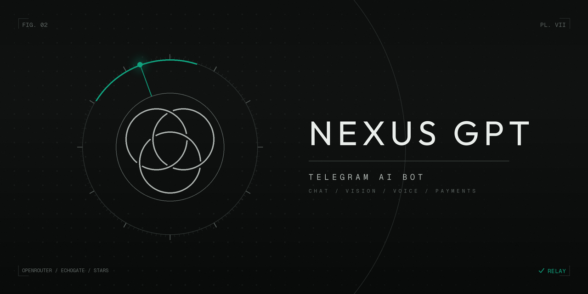

<div align="center">



# 🤖 Nexus GPT

**AI-ассистент в Telegram** — чат, зрение, голос, платежи и админка в одном файле


</div>

---

## ✨ Возможности

| | |
|---|---|
| 💬 **Чат** | 4 категории моделей (Кодинг / Универсальные / Быстрые / Творчество), авто-перебор при 429 и сбоях провайдеров |
| 👁 **Зрение** | фото автоматически уходят на vision-модели |
| 🎙 **Голос** | распознавание голосовых, аудио, видео и кружков через Mistral Voxtral |
| 📄 **Документы** | PDF / DOCX / TXT попадают в контекст запроса |
| 💰 **Экономика** | баланс токенов, пакеты, Premium, ежедневный бонус со стриком |
| 💳 **Платежи** | Telegram Stars + рубли через Platega (СБП / карта / крипта) |
| 🎁 **Рефералы** | ссылки, отложенная награда за активность, бонусы за уровни |
| 🛠 **Админка** | статистика, рассылка, промокоды, распродажи, баны, возвраты Stars, экспорт CSV |
| 🧬 **Self-edit** | `/selfedit` — бот переписывает свой исходник через LLM: проверка синтаксиса, бэкап, авто-откат |

## 🚀 Запуск

```bash
git clone https://github.com/hamitovradmir457-oss/nexus-gpt.git
cd nexus-gpt
pip install -r requirements.txt
cp .env.example .env   # заполни токены
python app.py
```

Все секреты читаются из `.env` — **в коде их нет**, а сам файл закрыт `.gitignore`.

## 🗂 Структура

```
nexus-gpt/
├── app.py              # весь бот (да, целиком в одном файле)
├── requirements.txt    # зависимости
├── .env.example        # шаблон переменных окружения
└── .gitignore          # секреты и данные в гит не попадут
```

## ⚙️ Технические детали

- **Провайдеры моделей:** OpenRouter (+ Featherless / FreeTheAi / EchoGate как резерв)
- **Хранилище:** SQLite с WAL, автосейв раз в 60 с, денежные операции пишутся немедленно
- **Надёжность:** идемпотентность платежей, миграции схемы БД по факту, автобэкап БД и кода админам
- **Rich Message:** таблицы, формулы, спойлеры, заголовки — рендер через Bot API 10.1

---

<div align="center">

*Личный проект. Выложен как резервная копия и портфолио.*

</div>
